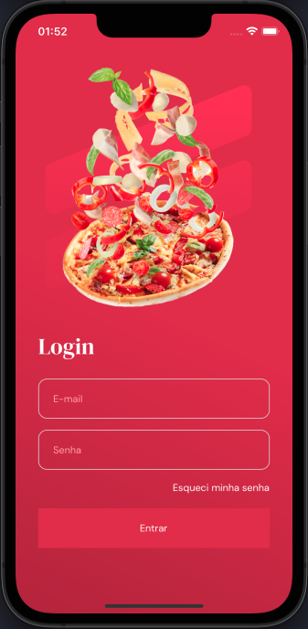
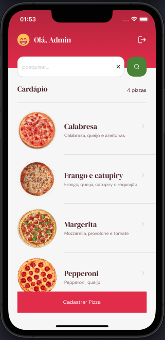
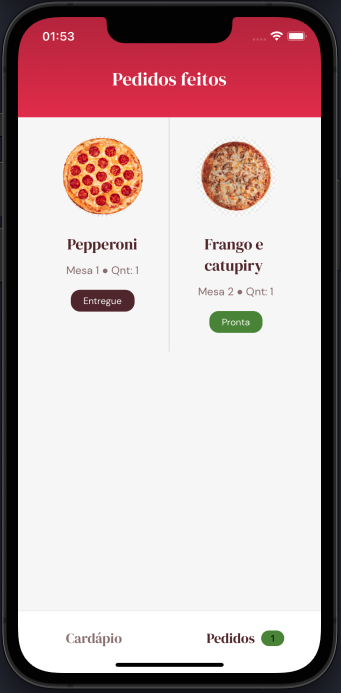

<h1 align="center">
    
    <h3 align="center">🍕 GoPizza 🍕</h3>
</h1>

<p align="center">
   
   
   
</p>

## :bookmark: About the project

React Native - Expo application for the GoPizza project developed at Ignite @ Rocketseat.

## 🚀 Technologies

Technologies that I used to develop this mobile client

- [React Native](https://reactnative.dev/)
- [Styled Components](https://styled-components.com/)
- [Expo](https://expo.io/)
- [TypeScript](https://www.typescriptlang.org/)
- [React Navigation](https://reactnavigation.org/)
- [Google Fonts](https://fonts.google.com/)
- [React Native Firebase](https://rnfirebase.io/)
- [Expo Image Picker](https://docs.expo.dev/versions/latest/sdk/imagepicker/)
- [ESLint](https://eslint.org/)

## 💻 Getting started

### Requirements

**Follow the steps below**

- Create a project in https://firebase.google.com/ and follow this guide https://efficient-sloth-d85.notion.site/Instala-o-e-Configura-o-Firebase-939e568bc5d240f8949a6ab1cafadd43
- Add a email/password login provider and then add two users
- Create a `Firestore Database` called `gopizza`, a collection called `users`, create a document using the `id` provided for each created user and then add two collections, `isAdmin` as `boolean` and `name` as `string`

**Clone the project and access the folder**

```bash
$ git clone https://github.com/leolivm/gopizza.git && cd gopizza
```

```bash
# Install the dependencies
$ yarn
```

Run the project

```bash
$ yarn start
```

---

Made with 💜 by Leandro Martins 👋 [See my linkedin](https://www.linkedin.com/in/leandro-martins-0640921a4/)
